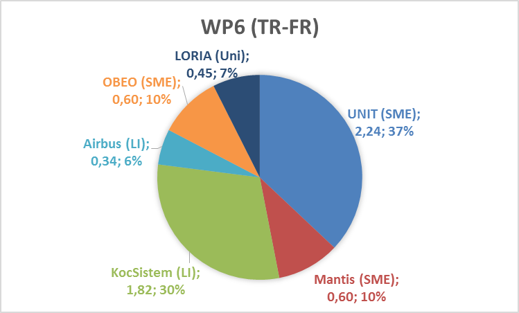

[Project-Management](https://waffle.io/modelwriter/deliverables)
==================
**Project Monitoring, Tracking, Communication Management and Infrastructure**

Project Management Scrum Board: [`https://waffle.io/modelwriter/deliverables`](https://waffle.io/modelwriter/deliverables) which is integrated into [`issue tracker`](https://github.com/modelwriter/deliverables/issues) of this repository.

[Project Teams](https://github.com/orgs/ModelWriter/teams)
=============
consortium@modelwriter.eu

[Project Coordination Committee (PCC)](https://github.com/orgs/ModelWriter/teams/pcc)
----
pcc@modelwriter.eu

| Partner    	                       | Primary Contact        | Secondary Contact      |
|:-------------------------------------|:---------------------- |:---------------------- |
| [UNIT](README.md#unit) |Ferhat Erata |Moharram Challenger |
| [OBEO](README.md#obeo) |Etienne Juliot |Yvan Lussaud |
| [MANTIS](README.md#mantis) |Erhan Mengüsoğlu |Güven Köse |
| [AIRBUS](README.md#AIRBUS) |Anne Monceaux |? |
| [LORIA](README.md#loria) |Claire Gardent |Samuel Cruz-Lara |
| [KOCSISTEM](README.md#kocsistem) |Mehmet Önat |Hale Gezgen |
| [HISBIM](README.md#hisbim) |Ersan Gürdoğan |Taskin Kızıl |
| [KUL](README.md#kul) |Monique Snoeck |Marie-Francine Moens |

[Technical Coordination Committee (TCC)](https://github.com/orgs/ModelWriter/teams/tcc)
----
tcc@modelwriter.eu

| Work Package | Primary Contact        | Secondary Contact      |
|:------------	|:---------------------- |:---------------------- |
| [WP1](README.md#work-package-1) (AIRBUS) | Anne Monceaux | ? |
| [WP2](README.md#work-package-2) (LORIA)| Claire Gardent | Samuel Cruz-Lara |
| [WP3](README.md#work-package-3) (UNIT) | Ferhat Erata | Moharram Challenger |
| [WP4](README.md#work-package-4) (MANTIS) | Erhan Mengüsoğlu | Güven Köse |
| [WP5](README.md#work-package-5) (UNIT) | Ferhat Erata | Moharram Challenger |
| [WP6](README.md#work-package-6) (OBEO)	| Etienne Juliot | Yvan Lussaud |
| [WP7](README.md#work-package-7) (OBEO)	| Etienne Juliot | Yvan Lussaud |

Coordination
----

Country | Partner | Primary Contact | Secondary Contact | Group Email
:----   |:-----   |:---------       |:----- |:-----
Project | UNIT | Ferhat Erata | Moharram Challenger | consortium@modelwriter.eu
[France](README.md#french-consortium---email-group-members) | OBEO | Etienne Juliot | Yvan Lussaud | france@modelwriter.eu
[Turkey](README.md#turkish-consortium---email-group-members) | MANTIS | Güven Köse | Erhan Mengüsoğlu | turkey@modelwriter.eu
[Belgium](README.md#belgian-consortium---email-group-members) | KUL | Monique Snoeck | Marie-Francine Moens | belgium@modelwriter.eu

French Consortium - Email Group Members
---
**france@modelwriter.eu**

Company Email | Gmail
:---- |:----
anne.monceaux@airbus.com | anne.monceaux@gmail.com
claire.gardent@loria.fr | claire.gardent@gmail.com
etienne.juliot@obeo.fr | etienne.juliot@gmail.com
yvan.lussaud@obeo.fr | yvan.lussaud@obeo.fr
samuel.cruz-lara@loria.fr | samuel.cruzlara@gmail.com

Turkish Consortium - Email Group Members
---
**turkey@modelwriter.eu**

Company Email | Gmail
:---- |:----
erhanmengusoglu@mantis.com.tr | mengusoglu@gmail.com
guvenkose@mantis.com.tr |
ferhat.erata@unitbilisim.com | ferhat@computer.org
emil.khamitov@unitbilisim.com | emil.khamitov@unitbilisim.com
moharram.challenger@unitbilisim.com | moharram.challenger@unitbilisim.com
furkan.tanriverdi@unitbilisim.com | furkan.tanriverdi@unitbilisim.com
geylani.kardas@ege.edu.tr | geylani@gmail.com
hale.gezgen@kocsistem.com.tr | hale.gezgen@gmail.com
mehmet.onat@kocsistem.com.tr | mehmetonat70@gmail.com
ersan@hisbim.com |
taskin@hisbim.com |
hans.vangheluwe@uantwerp.be | vangheluwe.hans@gmail.com

Belgian Consortium - Email Group Members
---
**belgium@modelwriter.eu**

Company Email | Gmail
:---- |:----
monique.snoeck@kuleuven.be |
sien.moens@cs.kuleuven.be |
hans.vangheluwe@uantwerp.be |

[UNIT](https://github.com/orgs/ModelWriter/teams/unit)
----
**UNIT Information Technologies R&D Ltd.**

|Contact |Corporate Email |GitHub |
|:--- |:--- |:---|
|Ferhat Erata |ferhat@computer.org |@ferhaterata |
|Moharram Challenger |moharram.challenger@unitbilisim.com |@m-challenger|
|Emil Khamitov |emil.khamitov@unitbilisim.com |@emilkhamitov |
|Yiğitcan Şener |yigitcan.sener@unitbilisim.com |@ycansener
|Furkan Tanrıverdi |furkan.tanriverdi@unitbilisim.com |@furkAn
|Prof. Hans Vangheluwe |hans.vangheluwe@uantwerpen.be |@HansVangheluwe

[OBEO](https://github.com/orgs/ModelWriter/teams/obeo)
----
**OBEO Software Company**

|Contact |Corporate Email |GitHub |
|:--- |:--- |:---|
|Etienne Juliot |etienne.juliot@obeo.fr |@ejuliot |
|Yvan Lussaud |yvan.lussaud@obeo.fr |@ylussaud |

[LORIA](https://github.com/orgs/ModelWriter/teams/loria)
----
**Lorraine Laboratory of Research in Computer Science and its Applications**

|Contact |Corporate Email |GitHub |
|:--- |:--- |:---|
|Claire Gardent |claire.gardent@loria.fr |@ClaireEMG |
|Samuel Cruz-Lara |Samuel.Cruz-Lara@loria.fr |@scruzlara |

[AIRBUS](https://github.com/orgs/ModelWriter/teams/AIRBUS)
----
**AIRBUS France Départment Innovation Works**

|Contact |Corporate Email |GitHub |
|:--- |:--- |:---|
|Anne Monceaux |anne.monceaux@airbus.com |@annemonceaux |

[MANTIS](https://github.com/orgs/ModelWriter/teams/mantis)
----
**Mantis Software Company**

|Contact |Corporate Email |GitHub |
|:--- |:--- |:---|
|Prof.Erhan Mengüsoğlu |erhanmengusoglu@mantis.com.tr |@mengusoglu |
|Dr. Güven Köse |guvenkose@mantis.com.tr |@ |

[KOCSISTEM](https://github.com/orgs/ModelWriter/teams/kocsistem)
----
**KoçSistem Bilgi ve İletişim Teknolojileri A.Ş.**

|Contact |Corporate Email |GitHub |
|:--- |:--- |:---|
|Mehmet Önat |mehmet.onat@kocsistem.com.tr |@MehmetOnat |
|Hale Gezgen |hale.gezgen@kocsistem.com.tr |@halegezgen |
|Prof. Geylani Kardaş |geylani.kardas@ege.edu.tr |@geylani |

[HISBIM](https://github.com/orgs/ModelWriter/teams/hisbim)
----
**Hisbim Bilgi ve İletişim Teknolojileri San. ve Tic. A.Ş.**

|Contact |Corporate Email |GitHub |
|:--- |:--- |:---|
|Taskin Kızıl |taskin@hisbim.com |@ |
|Ersan Gürdoğan |ersan@hisbim.com |@ersangurdogan |

[KUL](https://github.com/orgs/ModelWriter/teams/kul)
----
**Katholieke Universiteit Leuven**

|Contact |Corporate Email |GitHub |
|:--- |:--- |:---|
|Prof. Monique Snoeck |monique.snoeck@kuleuven.be|@ |
|Prof. Marie-Francine Moens |sien.moens@cs.kuleuven.be|@ |

Work Packages, Tasks and Deliverables
===========

The exhaustive list of deliverables `D\<x\>.\<y\>.\<z\>` associated to each Task `T\<x\>.\<y\>` of each `WP\<x\>`.

Conventions for WP start date and end date:
* **M\<i\> always means start of the month \<i\>.**
* Q\<i\> always means start of quarter \<i\>
* Y\<i\> always means start of year \<i\>
* First month is M1, first quarter is Q1, first year is Y1.

Therefore:
* First day of project is M1.
* End of the 3-years project is expressed as M37

For each Work Package (WP), the follwoings are described:
* the timeline;
* the starting point, objectives and expected results;
* the WP tasks;
* the detailed contributions of the partners involved in the WP;
* the type, content, confidentiality and planned delivery date of deliverables.

Deliverables can be:
*	either textual deliverables, i.e. documents (pdf, docx, etc.) (cf. “Doc.” in the second column of the deliverable tables);
*	or software deliverables (executables, packages, libraries, compiled or source code, etc.) (cf. “SW” in the deliverables tables); software deliverables do not have to be uploaded to the ITEA Community website and remain in the hands of the consortium.

Deliverable titles (descriptions) are self-explanatory.

## WP1 - Industrial Use Cases and Requirements (AIRBUS)

### T1.1 - Evaluation Methods & Tools [UNIT + KOCSISTEM + AIRBUS + OBEO + HISBIM + MANTIS]

| Month | Deliverable | Type    | Access  | Leader
|:----- |:----------- |:------- |:------- |:-------
| [M3 -> M5]  | D1.1.1 Report: Evaluation Methods & Tools | Doc. | Public | UNIT -> HISBIM

### T1.2 - Industrial Use Cases for Belgium Consortium [SA -> Sogeti]

| Month | Deliverable | Type    | Access  | Leader
|:----- |:----------- |:------- |:------- |:-------
| [M3 -> M7]  | D1.2.1 Report: Industrial Use Cases for Belgian Consortium | Doc. | Public | Sogeti
| [M3 -> M7]  | D1.2.2 Data: Corpus for D1.2.1 (public part) | SW | Public | Sogeti
| [M3 -> M7]  | D1.2.3 Data: Corpus for D1.2.1 (confidential part) | SW | Confidential | Sogeti

### T1.3 - Industrial Use Cases for French Consortium [OBEO + AIRBUS]

| Month | Deliverable | Type    | Access  | Leader
|:----- |:----------- |:------- |:------- |:-------
| [M3 -> M5]  | D1.3.1 Report: Industrial Use Cases for French Consortium | Doc. | Public | AIRBUS
| [M3 -> M5]  | D1.3.2 Data: Corpus for D1.2.1 (public part) | SW | Public | AIRBUS
| [M3 -> M5]  | D1.3.3 Data: Corpus for D1.2.1 (confidential part) | SW | Confidential | AIRBUS

### T1.4 - Industrial Use Cases for Turkish Consortium [MANTIS + UNIT + KOCSISTEM + HISBIM]

| Month | Deliverable | Type    | Access  | Leader
|:----- |:----------- |:------- |:------- |:-------
| [M3 -> M7]  | D1.4.1 Report: Industrial Use Cases for Turkish Consortium | Doc. | Public | MANTIS
| [M3 -> M7]  | D1.4.2 Data: Corpus for D1.3.1 (public part) | SW | Public | MANTIS
| [M3 -> M7]  | D1.4.3 Data: Corpus for D1.3.1 (confidential part)| SW | Confidential | MANTIS

### T1.5 - Consolidated User Requirements [SA -> AIRBUS + OBEO + MANTIS ++ Sogeti]

| Month | Deliverable | Type    | Access  | Leader
|:----- |:----------- |:------- |:------- |:-------
| [M3 -> M7]  | D1.5.1 Report: User Requirements Document (URD) for ModelWriter | Doc. | Public | SA -> UNIT

### T1.6 - User Requirements Review [SA -> AIRBUS + UNIT + KOCSISTEM + KUL + ALL]

| Month | Deliverable | Type    | Access  | Leader
|:----- |:----------- |:------- |:------- |:-------
| [M3 -> M7]  | D1.6.1 Report: Minutes of the User Requirements Review meeting | Doc. | Public | SA -> AIRBUS

### T1.7 - Software Requirements [SA -> AIRBUS + LORIA + UNIT + MANTIS + OBEO]

| Month | Deliverable | Type    | Access  | Leader
|:----- |:----------- |:------- |:------- |:-------
| [M5 -> M9]  | D1.7.1 Report: Software Requirements Document (SRD) for ModelWriter | Doc. | Public | SA -> KOCSISTEM

### T1.8 - Software Requirements Review [SA -> AIRBUS + UNIT + KOCSISTEM + ALL]

| Month | Deliverable | Type    | Access  | Leader
|:----- |:----------- |:------- |:------- |:-------
| [M5 -> M9]  | D1.8.1 Report: Minutes of the Software Requirements Review meeting | Doc. | Public | SA -> AIRBUS

### T1.9 - Annual Product Review [SA -> AIRBUS + Country Coordinators - "Product Review Comittee"]

| Month | Deliverable | Type    | Access  | Leader
|:----- |:----------- |:------- |:------- |:-------
| [M13 -> M15] | D1.9.1-1 Report: Annual Product Owner Review | Doc. | Public | SA -> AIRBUS
| [M25 -> M26] | D1.9.1-2 Report: Annual Product Owner Review | Doc. | Public | SA -> AIRBUS
| [M37] | D1.9.1-3 Report: Annual Product Owner Review | Doc. | Public | SA -> AIRBUS

### T1.10 - Technical Risk Assessment and Management [OBEO + UNIT + KOCSISTEM + ALL]

| Month | Deliverable | Type    | Access  | Leader
|:----- |:----------- |:------- |:------- |:-------
| [M5 -> M9]  | D1.10.1 Technical Risk Assessment Document | Doc. | Public | OBEO

## WP2 - Semantic Parsing and Generation of Documents and Documents Components (LORIA)

### T2.1 - Data Collection [LORIA + KUL -SA ++ OBEO ++ AIRBUS ++Sogeti]

| Month | Deliverable | Type    | Access  | Leader (Members)
|:----- |:----------- |:------- |:------- |:-------
| [M3 -> M7 -> M8]  | D2.1.1 Report: Software Requirements - Evaluation of the natural language processing requirements set by the use cases | Doc. | Public | LORIA (KUL)
| [M6 -> M8]  | D2.1.2 Data: Corpora (Text, Knowledge, Bi-Texts) and Report: Documentation of the corpora | Doc. | Public | LORIA (OBEO, AIRBUS, KUL)

### T2.2 - Hybrid approaches to semantic parsing [KUL + LORIA]

| Month | Deliverable | Type    | Access  | Leader (Members)
|:----- |:----------- |:------- |:------- |:-------
| [M4 -> M6]  | D2.2.1 Report: Overview and comparison of existing deep semantic parsers | Doc. | Public | KUL -> LORIA (KUL)

### T2.3 - Hybrid approaches to Natural Language Generation [LORIA - VUB + KUL]

| Month | Deliverable | Type    | Access  | Leader (Members)
|:----- |:----------- |:------- |:------- |:-------
| [M5 -> M7]  | D2.3.1 Report: Overview and comparison of existing generators | Doc. | Public | LORIA (KUL)

### T2.4 - Definition of the target semantic representation language [- VUB + KUL + LORIA ++ OBEO ++ AIRBUS]

| Month | Deliverable | Type    | Access  | Leader
|:----- |:----------- |:------- |:------- |:-------
| [M8 -> M10]  | D2.5.1	Report: Specification of the Knowledge Representation Language(s) output by the parser and input to the generator | Doc. | Public | VUB -> LORIA (OBEO, AIRBUS)

### T2.5 - Development of the semantic parser and of the generator [LORIA + KUL + MANTIS - VUB + AIRBUS ++ OBEO]

| Month | Deliverable | Type    | Access  | Leader (Members)
|:----- |:----------- |:------- |:------- |:-------
| [M8 -> M10]  | D2.5.2-1 Software: Semantic Parser and Report: Software Documentation (release 1) | SW | Public | KUL -> LORIA (KUL, MANTIS)
| [M20 -> M22] | D2.5.2-2 Software: Semantic Parser and Report: Software Documentation (release 2) | SW | Public | KUL -> LORIA (KUL, MANTIS)
| [M28 -> M30] | D2.5.2-3 Software: Semantic Parser and Report: Software Documentation (release 3) | SW | Public | KUL -> LORIA (KUL, MANTIS)

| Month | Deliverable | Type    | Access  | Leader (Members)
|:----- |:----------- |:------- |:------- |:-------
| [M8 -> M10]  | D2.5.3-1 Software: Natural Language Generator and Report: Software Documentation (release 1) | SW | Public | LORIA (KUL, MANTIS)
| [M20 -> M22] | D2.5.3-2 Software: Natural Language Generator and Report: Software Documentation (release 2) | SW | Public | LORIA (KUL, MANTIS)
| [M28 -> M30] | D2.5.3-3 Software: Natural Language Generator and Report: Software Documentation (release 3) | SW | Public | LORIA (KUL, MANTIS)

| Month | Deliverable | Type    | Access  | Leader (Members)
|:----- |:----------- |:------- |:------- |:-------
| [M10 -> M12] | D2.5.4-1 Software: Integration in ModelWriter and Report: Software Documentation (release 1) | SW | Public | SA -> OBEO
| [M22 -> M24] | D2.5.4-1 Software: Integration in ModelWriter and Report: Software Documentation (release 2) | SW | Public | SA -> OBEO
| [M30 -> M32] | D2.5.4-1 Software: Integration in ModelWriter and Report: Software Documentation  (release 3) | SW | Public | SA -> OBEO

## WP3 - Model to/from Knowledge Base (UNIT)

### T3.1 - Review of M2M transformation approaches  [UNIT + KOCSISTEM]

| Month | Deliverable | Type    | Access  | Leader
|:----- |:----------- |:------- |:------- |:-------
| [M3 -> M5]  | D3.1.1 Review of model-to-model transformation approaches and technologies | Doc. | Public | UNIT

### T3.2 - Specification and design of the M2M Transformation Framework [UNIT + KOCSISTEM]

| Month | Deliverable | Type    | Access  | Leader
|:----- |:----------- |:------- |:------- |:-------
| [M4 -> M6]  | D3.2.1 M2M Transformation Framework architectural design document | Doc. | Public | UNIT

### T3.3 - Development of the Transformation Manager component [UNIT + KOCSISTEM]

| Month | Deliverable | Type    | Access  | Leader
|:----- |:----------- |:------- |:------- |:-------
| [M5 -> M7]   | D3.3.1 Transformation Manager architectural (TRAM) design document | Doc. | Public | UNIT
| [M8 -> M10]  | D3.3.2-1 Software: Transformation Manager component (release 1) | SW | Public | UNIT
| [M20 -> M22] | D3.3.2-2 Software: Transformation Manager component (release 2) | SW | Public | UNIT
| [M30 -> M32] | D3.3.2-3 Software: Transformation Manager component (release 3) | SW | Public | UNIT

### T3.4 - Development of the Configuration Manager (COM) component [UNIT + KOCSISTEM]

| Month | Deliverable | Type    | Access  | Leader
|:----- |:----------- |:------- |:------- |:-------
| [M6 -> M8]   | D3.4.1 Configuration Manager architectural design document | Doc. | Public | UNIT
| [M8 -> M10]  | D3.4.2-1 Software: Configuration Manager component (release 1) | SW | Public | UNIT
| [M20 -> M22] | D3.4.2-2 Software: Configuration Manager component (release 2) | SW | Public | UNIT
| [M30 -> M32] | D3.4.2-3 Software: Configuration Manager component (release 3) | SW | Public | UNIT

### T3.5 - Development of the Traceability Manager component [UNIT + KOCSISTEM]

| Month | Deliverable | Type    | Access  | Leader
|:----- |:----------- |:------- |:------- |:-------
| [M7 -> M9]   | D3.5.1 Traceability Manager architectural design document | Doc. | Public | UNIT
| [M8 -> M10]  | D3.5.2-1 Software: Traceability Manager component (release 1) | SW | Public | UNIT
| [M20 -> M22] | D3.5.2-2 Software: Traceability Manager component (release 2) | SW | Public | UNIT
| [M30 -> M32] | D3.5.2-3 Software: Traceability Manager component (release 3) | SW | Public | UNIT

### T3.6 - Development of the Synchronization Manager component [UNIT + KOCSISTEM]

| Month | Deliverable | Type    | Access  | Leader
|:----- |:----------- |:------- |:------- |:-------
| [M8 -> M10]  | D3.6.1 Synchronization Manager architectural design document | Doc. | Public | UNIT
| [M8 -> M10]  | D3.6.2-1 Software: Synchronization Manager component (release 1) | SW | Public | UNIT
| [M20 -> M22] | D3.6.2-2 Software: Synchronization Manager component (release 2) | SW | Public | UNIT
| [M30 -> M32] | D3.6.2-3 Software: Synchronization Manager component (release 3) | SW | Public | UNIT

### T3.7 - Design of the model-to-model transformations [UNIT + MANTIS - VUB]

| Month | Deliverable | Type    | Access  | Leader
|:----- |:----------- |:------- |:------- |:-------
| [M18 -> M10] | D3.7.1 Model-to-model transformations (from user-visible models to KB-stored models) design document | Doc. | Public | UNIT -> MANTIS

### T3.8 - Implementation of the model-to-model transformations [UNIT - VUB]

| Month | Deliverable | Type    | Access  | Leader
|:----- |:----------- |:------- |:------- |:-------
| [M11 -> M13] | D3.8.1-1 Software: Source and binary code of each model-to-model transformation (release 1) | SW | Public | UNIT
| [M21 -> M23] | D3.8.1-3 Software: Source and binary code of each model-to-model transformation (release 2) | SW | Public | UNIT
| [M31 -> M33] | D3.8.1-3 Software: Source and binary code of each model-to-model transformation (release 3) | SW | Public | UNIT

### T3.9 - Validation of the M2M Transformation Framework [UNIT + MANTIS - VUB + KOCSISTEM]

| Month | Deliverable | Type    | Access  | Leader
|:----- |:----------- |:------- |:------- |:-------
| [M32 -> M34] | D3.9.1 Test-plan for the M2M Transformation Framework | Doc. | Public | UNIT -> MANTIS
| [M33 -> M35] | D3.9.2 Field experiment concerning ModelWriter model transformations | SW | Public | UNIT

## WP4 - Knowledge Base Design and Implementation (Mantis)

### T4.1 - Design of the Knowledge Base [- VUB - SA + OBEO + MANTIS + UNIT + KOCSISTEM]

| Month | Deliverable | Type    | Access  | Leader
|:----- |:----------- |:------- |:------- |:-------
| [M6]  | D4.1.1 Report: Knowledge Base Design document | Doc. | Public | VUB -> OBEO

### T4.2 - API of the Knowledge Base [- VUB + KOCSISTEM + OBEO + UNIT]

| Month | Deliverable | Type    | Access  | Leader
|:----- |:----------- |:------- |:------- |:-------
| [M6]  | D4.2.1 Report: Interface Control Document (ICD) |Doc. | Public | VUB -> KOCSISTEM

### T4.3 - Implementation of the Knowledge Base [- VUB]

| Month | Deliverable | Type    | Access  | Leader
|:----- |:----------- |:------- |:------- |:-------
| [M11 -> M13]  | D4.3.1-1 Software: Knowledge Base (release 1) | SW | Public | VUB -> MANTIS
| [M19 -> M23]  | D4.3.1-2 Software: Knowledge Base (release 2) | SW | Public | VUB -> MANTIS
| [M31 -> M33]  | D4.3.1-3 Software: Knowledge Base (release 3) | SW | Public | VUB -> MANTIS

### T4.4 - Plug-in #1: ModelWriter-assisted requirements review [- VUB - SA]

  > This plug-in and associated deliverables were suggested by VUB.

| Month | Deliverable | Type    | Access  | Leader
|:----- |:----------- |:------- |:------- |:-------
| [M35] | D4.4.1 Report: Technical Note for ModelWriter-assisted Quality Review of Requirements | Doc. | Public | VUB -> ?
| [M35] | D4.4.2 Software: Proof-of-concept model checker | SW | Public | VUB -> ?

### T4.5 - Knowledge Base serialization and reuse plug-in [MANTIS]

| Month | Deliverable | Type    | Access  | Leader
|:----- |:----------- |:------- |:------- |:-------
| [M11 -> M13] | D4.5.1 Report: Technical Note for KB serialization and reuse | Doc. | Public | MANTIS

### T4.6 - Plug-in #3: ModelWriter-assisted semantic comparison of 2 documents [OBEO + MANTIS]

| Month | Deliverable | Type    | Access  | Leader
|:----- |:----------- |:------- |:------- |:-------
| [M20] | D4.6.1 Report: Technical Note for ModelWriter-assisted Comparison of 2 Documents | Doc. | Public | OBEO
| [M11 -> M13] | D4.6.2-1 Software: Proof-of-concept semantic comparison engine (release 1) | SW | Public | OBEO
| [M19 -> M23] | D4.6.2-2 Software: Proof-of-concept semantic comparison engine (release 2) | SW | Public | OBEO
| [M31 -> M33] | D4.6.2-3 Software: Proof-of-concept semantic comparison engine (release 3) | SW | Public | OBEO

### T4.7 - Plug-in #2: ModelWriter-assisted compliance review [-SA]

| Month | Deliverable | Type    | Access  | Leader
|:----- |:----------- |:------- |:------- |:-------
| [M10] | D4.7.1 Report: Future ModelWriter-Enabled Use Cases | Doc. | Public | SA -> ?

### T4.9 - Internal bi-directional synchronization mechanism [OBEO + UNIT]

### T4.10 – External synchronization mechanism for collaborating ModelWriters [SA]

## WP5 - Project Management (UNIT)

### T5.1 - Communication Management and Collaboration Infrastructure [UNIT + WP7 leader]

| Month | Deliverable | Type    | Access  | Leader
|:----- |:----------- |:------- |:------- |:-------
| [M1]  | D5.1.1 Project Kick-Off Report and Project Management Plan | Doc. | Public | UNIT

### T5.2 - Project Coordination and Reporting [UNIT - SA + Country Coordinators + WP Leaders]

| Month | Deliverable | Type    | Access  | Leader
|:----- |:----------- |:------- |:------- |:-------
| [M7]  | D5.2.1 Project Progress Report (first half year)  | Doc. | Confidential | UNIT
| [M13] | D5.2.2 Project Progress Report (second half year) | Doc. | Confidential | UNIT
| [M19] | D5.2.3 Project Progress Report (third half year)  | Doc. | Confidential | UNIT
| [M25] | D5.2.4 Project Progress Report (fourth half year) | Doc. | Confidential | UNIT
| [M31] | D5.2.5 Project Progress Report (fifth half year)  | Doc. | Confidential | UNIT

### T5.3 - Closing Project [UNIT + WP Leaders]

| Month | Deliverable | Type    | Access  | Leader
|:----- |:----------- |:------- |:------- |:-------
| [M37] | D5.3.1 Final Project Report | Doc. | Confidential | UNIT
| [M37] | D5.3.2 Updated State-of-the-art (Public Deliverable) | Doc. | Public | UNIT

## WP6 - ModelWriter Architecture, Integration and Evaluation (OBEO)

### T6.1 - Experimental Prototyping [OBEO - SA - VUB]

| Month | Deliverable | Type    | Access  | Leader
|:----- |:----------- |:------- |:------- |:-------
| [M5 -> M6]  | D6.1.1 Software: Prototype Core ModelWriter (OBEO, SA, VUB) | SW | Public | OBEO

### T6.2 - Architectural Design [OBEO - SA - VUB + MANTIS + UNIT + technological WP Leaders]

| Month | Deliverable | Type    | Access  | Leader
|:----- |:----------- |:------- |:------- |:-------
| [M5 -> M6]  | D6.2.1 Report: Architectural Design Document (ADD) (OBEO, SA, VUB, Mantis) | Doc. | Public | OBEO

### T6.3 - Writer Part enhancements [- SA]

| Month | Deliverable | Type    | Access  | Leader
|:----- |:----------- |:------- |:------- |:-------
| [M10] | D6.3.1-1 Software: Writer enhancements (release 1) | SW | Public | SA -> ?
| [M20] | D6.3.1-2 Software: Writer enhancements (release 2) | SW | Public | SA -> ?
| [M34] | D6.3.1-3 Software: Writer enhancements (release 3) | SW | Public | SA -> ?

### T6.4 - User Interfaces Implementation [- SA + OBEO]

#### User Interface for the Writer part [- SA]

| Month | Deliverable | Type    | Access  | Leader
|:----- |:----------- |:------- |:------- |:-------
| [M7]  | D6.4.1 Report: Ergonomics Guidelines document for the Writer Part | Doc. | Public | SA -> ?
| [M10] | D6.4.2-1 Software: User Interface for the Writer part (release 1) | SW | Public | SA -> ?
| [M20] | D6.4.2-2 Software: User Interface for the Writer part (release 2) | SW | Public | SA -> ?
| [M34] | D6.4.2-3 Software: User Interface for the Writer part (release 3) | SW | Public | SA -> ?

#### Software: IDE-integrated User Interface to handle Synchronization  [Obeo]

| Month | Deliverable | Type    | Access  | Leader
|:----- |:----------- |:------- |:------- |:-------
| [M10] | D6.4.3-1 Software: IDE-integrated User Interface to handle Synchronization issues major release (release 1) | SW | Public | OBEO
| [M20] | D6.4.3-2 Software: IDE-integrated User Interface to handle Synchronization issues major release (release 2) | SW | Public | OBEO
| [M34] | D6.4.3-3 Software: IDE-integrated User Interface to handle Synchronization issues major release (release 3) | SW | Public | OBEO

### T6.5 - Acceptance Test Plan [- SA + UNIT + KS + ALL]

| Month | Deliverable | Type    | Access  | Leader
|:----- |:----------- |:------- |:------- |:-------
| [M10] | D6.5.1-1 Report: Acceptance Test Plan (release 1) (SA + all) | Doc. | Public | SA -> ?
| [M20] | D6.5.1-2 Report: Acceptance Test Plan (release 2) (SA + all) | Doc. | Public | SA -> ?
| [M34] | D6.5.1-3 Report: Acceptance Test Plan (release 3) (SA + all) | Doc. | Public | SA -> ?
| [M10] | D6.5.2-1 Software: Automated Acceptance Tests (release 1) (SA + all | SW | Public | SA -> ?
| [M20] | D6.5.2-2 Software: Automated Acceptance Tests (release 2) (SA + all) | SW | Public | SA -> ?
| [M34] | D6.5.2-3 Software: Automated Acceptance Tests (release 3) (SA + all) | SW | Public | SA -> ?

### T6.6 - Acceptance Test Procedures [- SA + UNIT + KS + ALL]

| Month | Deliverable | Type    | Access  | Leader
|:----- |:----------- |:------- |:------- |:-------
| [M10] | D6.6.1-1 Report: Acceptance Test Procedures (release 1) (SA + all) | Doc. | Public | SA -> ?
| [M20] | D6.6.1-2 Report: Acceptance Test Procedures (release 2) (SA + all) | Doc. | Public | SA -> ?
| [M34] | D6.6.1-3 Report: Acceptance Test Procedures (release 3) (SA + all) | Doc. | Public | SA -> ?

### T6.7 - ModelWriter Integration [OBEO + UNIT + ALL]

| Month | Deliverable | Type    | Access  | Leader
|:----- |:----------- |:------- |:------- |:-------
| [M11] | D6.7.1-1 Software: ModelWriter major release (release 1) | SW | Public | OBEO
| [M23] | D6.7.1-2 Software: ModelWriter major release (release 2) | SW | Public | OBEO
| [M35] | D6.7.1-3 Software: ModelWriter major release (release 3) | SW | Public | OBEO

### T6.8 - Cyclic Evaluation of Analysis Performance [- SA + OBEO + LORIA + UNIT + KS + ALL]

| Month | Deliverable | Type    | Access  | Leader
|:----- |:----------- |:------- |:------- |:-------
| [M12] | D6.8.1-1 Report: Evaluation report (release 1) (All) | Doc. | Public | SA -> ?
| [M24] | D6.8.1-2 Report: Evaluation report (release 2) (All) | Doc. | Public | SA -> ?
| [M36] | D6.8.1-3 Report: Evaluation report (release 3) (All) | Doc. | Public | SA -> ?

## WP7 - Dissemination and Exploitation (OBEO)

### T7.1 - Dissemination Plan [OBEO + UNIT + SA + LORIA + KS + ALL]

| Month | Deliverable | Type    | Access  | Leader
|:----- |:----------- |:------- |:------- |:-------
| [M4 -> M6]  | D7.1.1 Dissemination Plan | Doc. | Public | OBEO

### T7.2 - Business Model & Exploitation Plan [AIRBUS + SA + OBEO + all industrial partners]

| Month | Deliverable | Type    | Access  | Leader
|:----- |:----------- |:------- |:------- |:-------
| [M7]  | D7.2.1-1 Exploitation Plan (release 1) | Doc. | Public | AIRBUS
| [M22] | D7.2.1-2 Exploitation Plan (release 2) | Doc. | Public | AIRBUS
| [M34] | D7.2.1-3 Exploitation Plan (release 3) | Doc. | Public | AIRBUS
| [M7]  | D7.2.2 Marketing Plan | Doc. | Public | AIRBUS
| [M34] | D7.2.3 Road-map for future exploitation and pre-competition survey| Doc. | Public | AIRBUS

### T7.3 - Workshops & Events [- VUB + UNIT + OBEO + KS + AIRBUS + ALL]

| Month | Deliverable | Type    | Access  | Leader
|:----- |:----------- |:------- |:------- |:-------
| [M31]  | D7.3.1 Newsletter - International Conference Announcement | Doc. | Public | VUB -> UNIT

### T7.4 - ModelWriter-ITEA Consortium Website [- SA]

| Month | Deliverable | Type    | Access  | Leader
|:----- |:----------- |:------- |:------- |:-------
| [M1]  | D7.4.1 ModelWriter-ITEA website including secured intranet | SW | Public | SA -> OBEO

### T7.5 - Community Forum & Open Source Campaign [- VUB + OBEO]

| Month | Deliverable | Type    | Access  | Leader
|:----- |:----------- |:------- |:------- |:-------
| [M10] | D7.5.1 Technical-oriented talk about the principles and benefits of the ModelWriter-ITEA approach and tooling | Doc. | Public | VUB -> OBEO
| [M10] | D7.5.2 Research-oriented talk about the principles and benefits of the ModelWriter-ITEA approach and tooling| Doc.  | Public | VUB -> UNIT

### T7.6 - Social Networks [UNIT + KOCSISTEM]

| Month | Deliverable | Type    | Access  | Leader
|:----- |:----------- |:------- |:------- |:-------
| [M10] | D7.6.1 ModelWriter-ITEA's Facebook Group | SW | Public | UNIT
| [M10] | D7.6.2 ModelWriter-ITEA's LinkedIn Group | SW | Public | UNIT
| [M10] | D7.6.3 ModelWriter-ITEA's Twitter Group | SW | Public | UNIT
| [M10] | D7.6.4 ModelWriter-ITEA's Google+ Group | SW | Public | UNIT

### T7.7 - Standardization [LORIA + UNIT + KOCSISTEM]

| Month | Deliverable | Type    | Access  | Leader
|:----- |:----------- |:------- |:------- |:-------
| [M34] | D7.7.1 ModelWriter and standardization activities | SW | Public | LORIA
